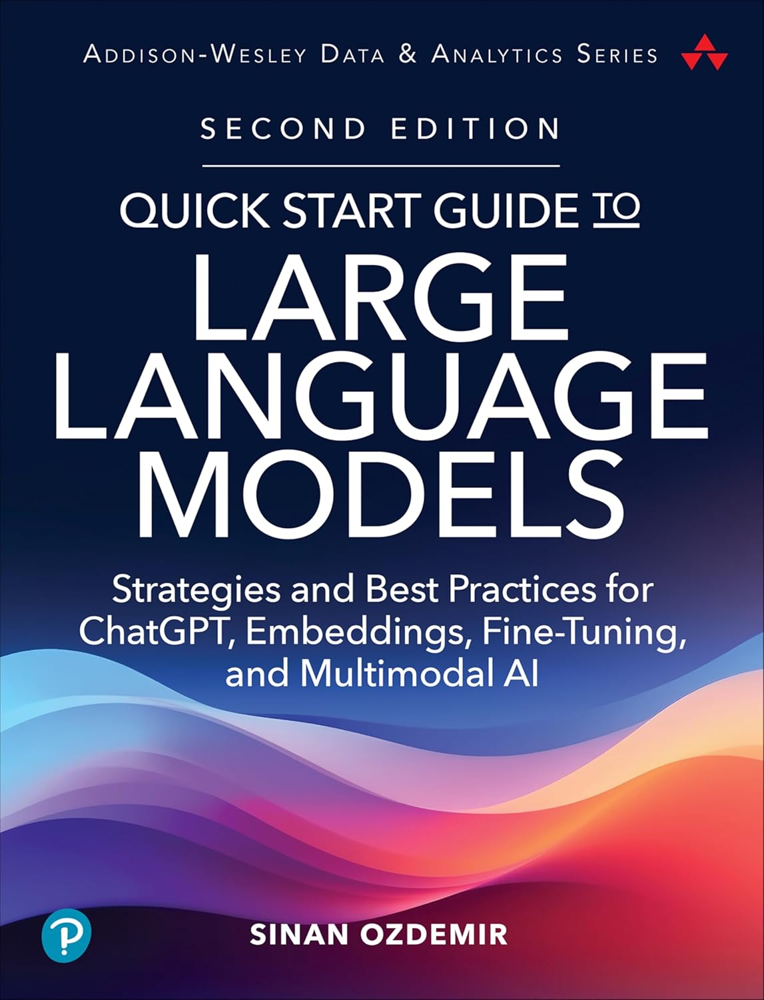

# LLMs from Protoype to Production
### LLMOps, Prompt Engineering, and Moving LLMs to the Cloud

Welcome to the GitHub repository for the ODSC workshop on LLMOps. This workshop is designed to help you unlock the full potential of LLMs through quantization, distillation, fine-tuning, Kubernetes, and so much more!

Most of these case studies are from my book: [Quick Start Guide to LLMs](https://github.com/sinanuozdemir/quick-start-guide-to-llms)

  

For more details and to join the workshop, click [here](https://odsc.com/speakers/llms-from-prototype-to-production-llmops-prompt-engineering-and-moving-llms-to-the-cloud/).

# Notebooks / Slides

Dive deep into the practical application with our comprehensive notebooks. These notebooks will guide you step by step through the two case studies covered in the workshop, allowing for an interactive and hands-on learning experience.

## Workshop Slides

Here are the slides for the workshop.

- **Slides: [ODSC LLMOps](./slides/ODSC - LLMs from Prototype to Production.pdf)**

## Case Study 1: Quantizing Llama 3

- **[Quantizing Llama-3 dynamically](https://colab.research.google.com/drive/12RTnrcaXCeAqyGQNbWsrvcqKyOdr0NSm?usp=sharing)** - Using bitsandbytes to quantize a model in real-time on load. We will investigate the differences before and after quantization

- See how to load a pre-quantized version of Llama to compare speed and memory usage:

	- **[Working with GGUF (no GPU)](https://colab.research.google.com/drive/15IC5cI-aFbpND5GrvKjAMas1Hmc7M6Rg?usp=sharing)**
	
	- **[Working with GGUF (with a GPU)](https://colab.research.google.com/drive/1D6k-BeuF8YRTR8BGi2YYJrSOAZ6cYX8Y?usp=sharing)**

## Case Study 2: Distilling LLMs

- **[Distilling BERT models to optimize for speed/memory](https://colab.research.google.com/drive/1GO8w1gC2TRII9-aaRNaFN6mkCglm2pJa?usp=sharing)** - See how to perform task-specific distillation to miniaturize a BERT model for classification

## Case Study 3: Deploying Quantized Llama 3 with llama.cpp

- **[This directory](./llama_cpp)** for a K8s demo of using embedding models and Llama 3 with GGUF on a GPU

## Case Study 4: Evaluating Generative AI
- **[Evaluating LLMs with Rubrics](https://colab.research.google.com/drive/1DeVYrdNb3FlQQLeBqGPFkx6roZaPwVRy?usp=sharing)** - Exploring a rubric prompt to evaluate generative output

- **[Evaluating Alignment (time permitting)](notebooks/evaluating_alignment.ipynb)** - Seeing how an LLM can judge agent's responses

## Extra Noteooks

Here are some notebooks that I reference during the workshop but won't have time to get into:

## Thank you!

If you enjoyed the case studies, please consider giving my book a 5 star rating on Amazon as it really helps me as an author! For more details and to join the workshop, click [here](https://odsc.com/speakers/llms-from-prototype-to-production-llmops-prompt-engineering-and-moving-llms-to-the-cloud/).
